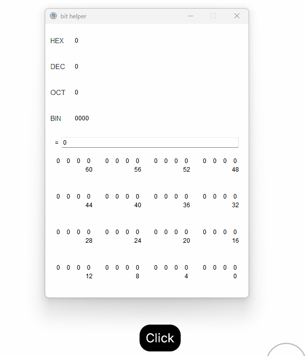

# bit_helper

#### 介绍
bit_helper可代替windows程序员计算器，支持以下功能
##### 优势功能
1. **支持直接输入计算公式表达式，更贴近程序员习惯**

   = 2 + 3 * 4

   = 12 << 3

   = (12 + 3) << 2
2. **支持部分BIT位使能功能，方便直接查看部分位的组合值**

   在解析或设置寄存器或位域的值时，使用十分方便，例如查看32位数据中第9~13位的值时可以使用此功能
##### 基本功能
1. 支持通过点击设置BIT位的值
2. 高亮显示位为1的值
3. 鼠标划过时高亮显示位的位置信息

#### 软件架构
语言：python
UI库：PyQt5

#### 安装教程
```bash
pip install pyqt5
```

#### 使用说明

##### 运行
```bash
python3 main.py
```
##### 计算表达式
1. 支持加减乘除以及位运算，运算符与python运算符一致

##### 部分位使能
1. 按住shift
2. 第一次按鼠标左键选择使能的最低位（包含点击的位）
3. 第二次按鼠标左键选择使能的最高位（包含点击的位）
4. 松开shift
5. 按鼠标右键可取消部分位使能功能